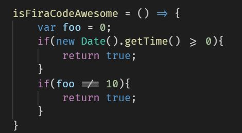

As developers we spend more time reading code, than writing. One of the most common tasks we do are comparing items. Using symbols can make your code easier & more enjoyable to read.

Here's an example of how adding coding symbols, also known as font ligatures look.



To add this to VS Code, do the following:

1. Install the [Fira Code font](https://github.com/tonsky/FiraCode) on your computer.

1. Edit your user settings in VS Code to use Font Ligatures and the 'Fira Code' font.

```json
"editor.fontFamily": "'Fira Code', Consolas, 'Courier New', monospace, 'Segoe UI Emoji'",
"editor.fontLigatures": true,
```

That's it! You're done! Enjoy an improved coding experience!