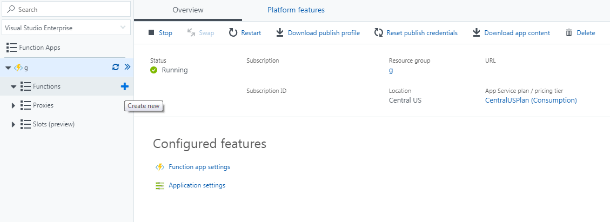
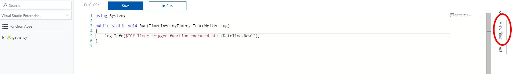
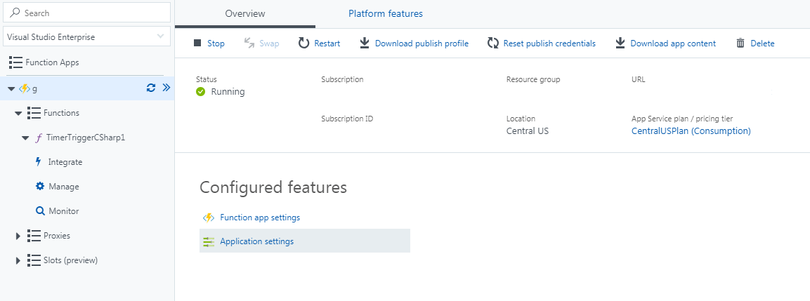

Serverless Functions are an awesome way to create small tasks that can run on a schedule, by the click of a button or using your voice. We'll create a function that visits a website, collects important data & sends that via an e-mail back to us on a schedule.

This project will use Azure Functions. They are dirt cheap, especially for this project. Like most serverless architectures, you only pay for the server time it takes your function to run. 

If you don't have an Azure account, a quick search for "Free Azure Account" should take you to Microsoft's latest offering.

## Create an Azure Function

Login to Azure and click to *Create a Resource*. Here you can search for *Functions* and add a *Function App*.

On the next screen give the app a name, select a resource group, etc. If you're new to this, drop me a line in the comments & I can walk you through these steps. Once done, click *Create*.

Once Azure has the new resources ready, you can either click the pop up that appears or go to *All Resources* and find the Function App there. The Function App has a lightning bolt icon.

On the next screen, hover over *Functions* on the left menu. Click the + sign that appears to create our Function.



Select *Timer* if you want to do this on a schedule or *Webhook+API* if you want a URL to send a request to so you can do it on demand. Also make sure C# is selected as the language below.

On the right side, click View Files.



Add a new `project.json` file and add the following text. Then click the Save button:

```json
{
  "frameworks": {
    "net46":{
      "dependencies": {
        "HtmlAgilityPack": "1.8.2"
      }
    }
  }
}
```

*Note: Currently only [.NET Framework 4.6 is supported on Azure Functions]( https://docs.microsoft.com/en-us/azure/azure-functions/functions-reference-csharp#using-nuget-packages). .Net Core is available in preview. If at any later time you wish to use .Net Core instead, adjust the framework snippet above. The following code should require minimum changes if any.*

For this demo & purposes of legality, we'll scrape [my blog's homepage](https://mattferderer.com). Here's the code I wrote. If you're looking to make multiple asynchronous requests, the comment in the GetLatestArticles function explains how.

```csharp
#r "SendGrid"
using System.Net;
using HtmlAgilityPack;
using SendGrid.Helpers.Mail;

// This is our main method that's called when the function runs. Azure passes the TimerInfo object and a TraceWriter object to output logs. We use C#'s out parameter modifier to work with Azure's Sendgrid e-mail integration using the Mail class.
public static void Run(TimerInfo myTimer, TraceWriter log, out Mail message)
{
    try{
        var latestArticle = GetLatestArticles().Result;
        log.Info(latestArticle);
        message = SendEmail(latestArticle);
    } catch (Exception e) {
        log.Info(e.ToString());
        message = SendEmail(e.ToString());
    }

}

public static async Task<string> GetLatestArticles() {
    var mattsLatestArticle = await GetMattsLatestArticle();
    /**
     * If you want to scrape additional resources with async, 
     * add more functions like above.
     *
     * Then return them like this:
     * return mattsLatestArticle + otherLatestArticle;
     */
    return mattsLatestArticle;
}

public static async Task<string> GetMattsLatestArticle() {
    string website = "https://mattferderer.com";

    HttpClient client = new HttpClient();
    string html = await client.GetStringAsync(website);

    HtmlDocument doc = new HtmlDocument();
    doc.LoadHtml(html); 

    var article = doc.DocumentNode
        .SelectNodes("//a")
        .FirstOrDefault(x => x.Attributes.Contains("class") && x.Attributes["class"].Value.Contains("article-link"));

    var url = article
        .Attributes
        .FirstOrDefault(x => x.Name == "href")
        .Value;

    var title = article
        .SelectSingleNode("//h2")
        .InnerHtml;

    return $"<p><a href=\"{website}{url}\">{title}</a></p>";
}

public static Mail SendEmail(string input) {
        var message = new Mail
    {
        Subject = "Latest Article"
    };

    var personalization = new Personalization();
    personalization.AddTo(new Email("yourEmail@example.com"));

    var content = new Content
    {
        Type = "text/html",
        Value = input
    };
    message.AddContent(content);
    message.AddPersonalization(personalization);
    return message;
}
```

## Add SendGrid Integration

Before this will send an e-mail it needs an e-mail service integrated with the Azure account. I recommend [SendGrid](https://sendgrid.com).

[SendGrid](https://sendgrid.com) is easy to integrate with Azure & a has a free developer plan. They're also a great provider in general. For these reasons, they're my go to for fun apps & production apps.

Create a [SendGrid](https://sendgrid.com) account and then go to settings > API Keys. Click create an API Key. Give it a name. Restricted access with `Mail Send` is all we need for permissions. Copy your API key somewhere safe.

Back in Azure, open the Functions Application Settings by clicking the app's name on the left menu. Then click Application Settings near the bottom under Configured features. (See highlighted links below)



Scroll down to the Application Settings, above Connection strings and click Add new setting.

Add the key `SendGridKey`. For the value, add the API key Sendgrid gave you. Click save.

Under the functions name on the left, click Integrate & add a new Output.

Select SendGrid from the list of Output options.

In the SendGrid API Key drop down menu on the next screen, select SendGridKey.

Fill out the From address & subject as well if you want defaults for the function.  Make sure to Save.

The output settings will now be added to the function.json file that Azure created for you if you did a Timer Trigger app. You can also find the schedule using a Cron pattern in there.

At this point, you should be able to run the Azure Function & have it send you an e-mail. If not, let me know in the comments.

## Additional Notes

If you're sending links in the e-mail, as done in the above example, you may find it useful to [turn off SendGrid's "Tracking Settings"](https://sendgrid.com/docs/User_Guide/Settings/tracking.html) feature. This feature changes your links & sometimes breaks them if you don't have this setup right. You can disable it on Sendgrid's Admin screen by going to Settings > Tracking.

You can debug your code locally using [VS Code](https://marketplace.visualstudio.com/items?itemName=ms-azuretools.vscode-azurefunctions) or [Visual Studio](https://docs.microsoft.com/en-us/azure/azure-functions/functions-develop-vs).
