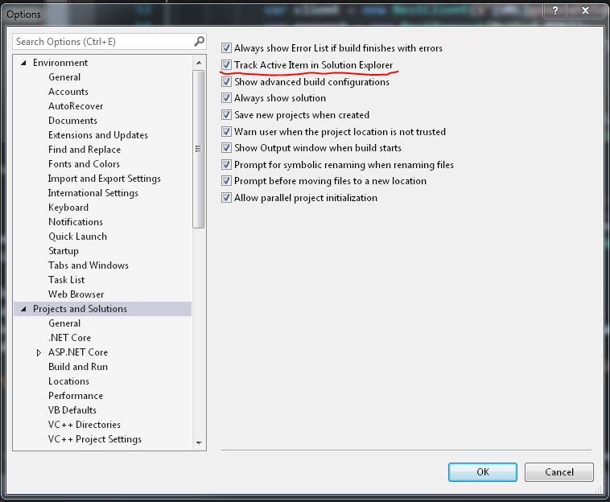

In VS Code, the file you are actively working on is always highlighted in the solution explorer. In Visual Studio this isn't the default. This makes comes a pain when working with large solutions, especially if those projects have multiple projects.

It turns out this is easy to fix!

In Visual Studio's menu go to Tools > Options > Projects and Solutions. Then check "Track Active Item in Solution Explorer".

## Add a Keyboard Shortcut to Change the Track Active Item in Solution Explorer Setting

This is great but sometimes this isn't ideal if you're temporarily opening up lots of files to look through them. In these cases it's nice to disable this setting. Keyboard shortcuts to the rescue!

We can add a shortcut to toggle this setting by going to Tools > Options > Environment > Keyboard. Search for and select the "View.TrackActivityinSolutionExplorer" setting.

 Here you can create a new keyboard shortcut. You can either assign it globally or create it for use in certain scenarios, such as only when you're in the solution explorer. I use `ctrl+alt+;` to toggle this setting.