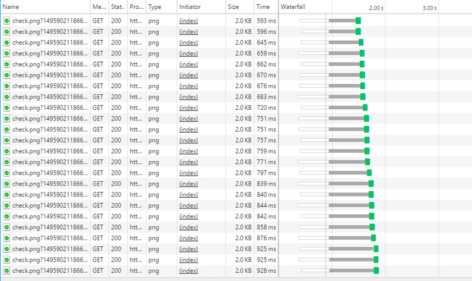
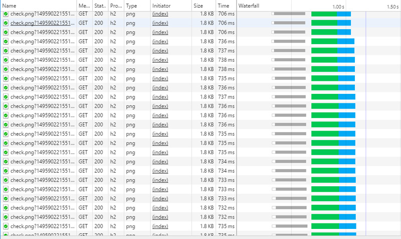

If content is king, the speed of your delivery may be queen. Slow websites lose readers & customers. Large companies have long recognized that every millisecond counts. 1/10 of a second costs Amazon 1% of their sales. 1/2 a second costs Google 20% of their traffic.[^n] That is a lot of money for those companies. Therefore they put immense effort into tactics to increase the speed of their sites. Fortunately for everyone, HTTP/2 eliminates the need for a lot of those tools.

HTTP/2 is the latest version of the HTTP protocol used to transfer files between your website and your visitors' browsers. Your visitors won't have to do anything different. HTTP/2 is already supported by every [major browser](http://caniuse.com/#feat=http2). Over 76% of global internet traffic & over 84% of traffic in the United States is from an HTTP/2 supported browser. Those numbers are growing daily. 

HTTP/2 is also easy to setup. The one major requirement is that your website has to have an SSL certificate. HTTP/2 only works with secure HTTPS websites. You should already have this. If you don't, you can get one for free from [Lets Encrypt](https://letsencrypt.org/). Web browser vendors are slowly forcing every site to use HTTPS. They're the ones who are also making HTTPS a requirement for HTTP/2. 

If you manage your own servers & keep them up to date, a minor edit to your [web server's configuration](https://dassur.ma/things/h2setup/#servers) is often all you need to do. The easiest way to enable HTTP/2 though is to use a free CDN like [CloudFlare](https://www.cloudflare.com/website-optimization/http2/). CloudFlare also gives you a free HTTPS certificate. It is simple to setup, even for people who aren't web developers. In fact, if web tech isn't your area of expertise, avoid reading the rest of this article & use that time to set your site up on CloudFlare. 

So why is HTTP/2 faster? The biggest benefit is multiplexing. In HTTP/1 the amount of files a downloaded from your website is often a bigger issue than the size of your files. To get around it, developers often merge unnecessary files together. With HTTP/2 the amount of files doesn't matter. The bottlenecks that created this issue in HTTP/1 are removed. You are now better off keeping files separate & serving only the files your visitor needs.

Here is a quick example of the website [HTTP vs HTTPS](http://www.httpvshttps.com/) where you can see what exactly is happening.  

With HTTP/1 a browser can only download 6 files at a time per website domain. This results in a waterfall effect. To achieve this, the browser opens 6 connections to your website. One connection for each file. Each connection will often take 100 milliseconds or more to make the initial connection. This connection time is even slower on mobile phone networks. Once connected, the file still needs to be downloaded. Having a "fast" internet only helps with the actual downloading of the file. The time it takes to make those connections depends more on the physical distance between you and the website serving it. One trick used by larger sites is known as sharding. They split their content on multiple website domains to increase the number of files that can be downloaded at once. Unfortunately, this still requires that 100+ millisecond delay to open each connection. To help lower that, these websites will put copies of their site in data centers all around the world to lower the physical distance between the website and the visitor.

The above picture uses HTTP/2. Here only one connection is made. With that one connection, multiple files can be downloaded at the same time. This prevents the waterfall effect & having to wait for 6 connections to be made. You can still use sharding but it could actually hurt your performance now. If you use sharding, take a look at some of the [workarounds](https://docs.google.com/presentation/d/1r7QXGYOLCh4fcUq0jDdDwKJWNqWK1o4xMtYpKZCJYjM/present?slide=id.g40fbe7d8c_076).

> In typical scenarios, with HTTP/1 the amount of files is more important than their size. In HTTP/2 the file size is more important than the amount of files. 

Since file size is more important in HTTP/2, site optimizations make more sense as well. With HTTP/1 it was common for websites to merge multiple images into a single image.  Developers would also combine all their JavaScript and CSS into one file to prevent having to download multiple files. This has caused websites to become bloated. The top 100 websites averaged 1/3 of a MB seven years ago. Today they're over 2.1 MB.[^n] That's bad for slow mobile connections. It's also bad for users with short attentions spans. In HTTP/2, this is now a practice to avoid. When a visitor opens your website you should send them only the files they need to view the site. You can use [preload and prefetch](https://medium.com/reloading/preload-prefetch-and-priorities-in-chrome-776165961bbf) to send additional files after your page has finished loading. This will save your visitors from needing to download them later. This works in HTTP/1 & HTTP/2, though [browser support](http://caniuse.com/#search=prefetch) is limited.

There are a few extra features to be aware of as well. HTTP/2 allows you to prioritize the order files are downloaded. It also reduces header content that is required to be sent along with a file. [Server Push](https://www.smashingmagazine.com/2017/04/guide-http2-server-push/) is another great addition. It replaces the need to use data URIs or inline CSS and JavaScript. You can use Server Push to push "above the fold" content with the HTML page when it is requested, instead of waiting for the browser to request it. 

HTTP/2 is creating a faster & more secure internet. Once you have HTTP/2 setup, you can test it with a service like [KeyCDN](https://tools.keycdn.com/http2-test) to make sure everything looks right. If you're interested in a few other performance tricks, check out the work Google is doing with [QUIC protocol](https://ma.ttias.be/googles-quic-protocol-moving-web-tcp-udp/) & [Brotli compression](https://blog.cloudflare.com/results-experimenting-brotli/).

[^n]: http://glinden.blogspot.com/2006/11/marissa-mayer-at-web-20.html
[^n]: http://httparchive.org/compare.php