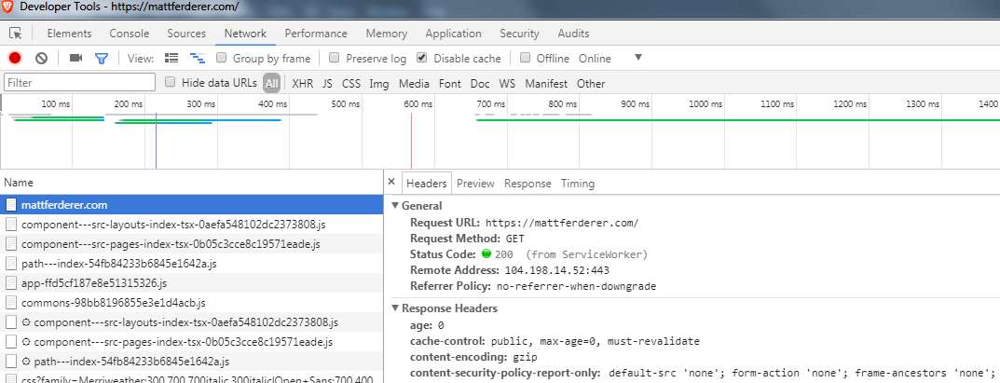

Cross-Site Scripting (XSS) sucks! XSS is when someone sneaks JavaScript or CSS into your site through a comment, a form, an advertisement or a NPM package that's part of your JavaScript build. Now they own every user's account that is visiting your website. XSS is such a common attack, [OWASP claims it happens in 2 out of every 3 websites & apps](https://www.owasp.org/index.php/Category:OWASP_Top_Ten_Project).

You can eliminate most XSS attacks with a CSP (Content Security Policy). A CSP lets you list external and internal scripts, styles, images and other content sources to allow. It's even compatible with [all the major browsers](https://caniuse.com/#search=Content%20Security%20Policy).

Since CSP can block one of the most common attacks known you think everyone would be using it, right? Nope! [Less than 2.5% of the top million visited sites use it](https://scotthelme.co.uk/alexa-top-1-million-analysis-february-2018/). 

> For most websites security is an afterthought, until someone steals all their data. Then the public rages on social media. The typical company response is to fire someone & promise to put security first, all while crossing their fingers behind their back.

Let's take a look at how we can avoid such a mess.

## How to Add a CSP Policy

The first step is to add a [header to your server configuration](https://mattferderer.com/how-to-add-a-header). It's recommended to start with the strictest CSP rule possible but set it to "report only" mode. This creates a report on what would happen if we blocked everything possible. Once you have your report you can start picking which items you want to allow (aka whitelist), which items to create alternate fixes for and which items to block.

Here's a recommended header to start with:

```
Content-Security-Policy-Report-Only: default-src 'none'; form-action 'none'; frame-ancestors 'none';
```

 Your CSP should appear along with your other headers when viewing your page in the browser's developer tools.

If we didn't set it to report mode, you would see *"The full power of CSP!"* In other words, the CSP would block most of your website.

> Remember, the role of a Content Security Policy (CSP) is to block everything you haven't allowed.

If you open up the console in your browser developer tools (F12) you typically will see a lot of errors. The first error might complain about lacking a report-uri but we'll get to that later. The rest of the errors should all start with [Report Only]. This is the CSP report mode letting you know what content would be blocked & how to allow it.

A CSS stylesheet is often one of the first errors that will appear. It will look something like this:

```
[Report Only] Refused to load the stylesheet 'https://example.com/style.css' because it violates the following Content Security Policy directive: "default-src 'none'". Note that 'style-src' was not explicitly set, so 'default-src' is used as a fallback.
```

To fix this, we adjust our policy by adding a style-src directive that allows 'self'. Adding 'self' allows us to include any CSS stylesheet hosted on the same URL & port number as our page. Without doing this, style-src defaults to the default-src directive which we have set to none.

```
Content-Security-Policy-Report-Only: default-src 'none'; form-action 'none'; frame-ancestors 'none'; style-src 'self';
```

Odds are high that you will also want to add 'self' to images and scripts. This would result in adjusting our CSP again.

```
Content-Security-Policy-Report-Only: default-src 'none'; form-action 'none'; frame-ancestors 'none'; style-src 'self'; script-src 'self'; img-src 'self';
```

A typical website needs to require external scripts as well. We can allow JavaScript from the domain [cdnjs.com](https://cdnjs.com/) by modifying our script-src directive.

```
Content-Security-Policy-Report-Only: default-src 'none'; form-action 'none'; frame-ancestors 'none'; style-src 'self'; script-src 'self' cdnjs.com; img-src 'self';
```

One thought you might have looking at our current rule is why did we explicitly declare directives for form-action & frame-ancestors? They are special cases that do not use the default-src fallback.

You can find the entire list of directives on [MDN](https://developer.mozilla.org/en-US/docs/Web/HTTP/Headers/Content-Security-Policy#Directives).

## Inline Script is My Middle Name

Inline JavaScript and CSS are often used on websites but they are also dangerous. They're the easiest way for a hacker to create an XSS attack. Therefore, to allow them you must add `'unsafe-inline'` to the directive you want to allow them for. This is to make sure you understand what you're doing isn't recommended.

A common CSS pattern is to inline your most important CSS that renders your 'above fold content' with `<style>` tags. This can help decrease the perceived rendering time. With [HTTP/2](https://mattferderer.com/switch-to-http2-the-easiest-way-to-speed-up-your-site) I  often argue against doing this as it [tends to be slower](https://next.smashingmagazine.com/2017/04/guide-http2-server-push/#test-outcomes). If you do choose to use inline scripts, you have three options.

1. Get a SHA-256 hash of the script & add it to our CSP. Chrome's dev tools will even generate a SHA-256 for you in the console when it displays the CSP error. Adding it to our current CSP example would look like this:

```
Content-Security-Policy-Report-Only: default-src 'none'; form-action 'none'; frame-ancestors 'none'; style-src 'self'; script-src 'self' cdnjs.com sha256-c2u0cNUv1GcIb92+ybgJ4yMPatX/k+xxHHbugKVGUU8=; img-src 'self';
```

2. Generate a unique nonce by your server for each inline script. This means each server request has to generate a new nonce. You would add it to your CSP the same way as a SHA-256, `nonce-47c2gtf3a1`. You also need to add it to the script tag: `<script nonce="47c2gtf3a1">`. It's rare to see nonces used as they are rather inconvenient to implement.

3. Allow inline scripts by adding `'unsafe-inline'` to your policy & hang your head in shame. This allows inline scripts, which weakens your CSP & allows XSS attacks. Doing this should cause you to feel some sadness.

## Cheer Up! Unsafe Inline Isn't the End of the World! Just Your Company. (Just kidding, sort of...)

When first implementing your CSP, there is a good chance you will need to use unsafe-inline on either your style-src or script-src directives. You might even need to allow JavaScript's eval function with unsafe-eval. *Gasp!*

> Just remember, a CSP should be one of many weapons in your security arsenal. It should not be your only weapon.

**Having a CSP with a few unsafe rules is still better than not having a CSP at all.** Not implementing a CSP at all would be the same as setting every directive to allow all of the unsafe CSP rules. 

For example, a common way to steal logins using CSS is by sending a request for a background image or font to an evil URL such as `http://evilexamplesite.com?password=a` where `a` is the letter you typed into the password login field. When you would type the next letter of your password, the evil CSS script would send another request but with that letter instead of `a`. The evil site then logs these requests to determine your username & password. By allowing unsafe-inline for our style-src, someone could inject this evil code. Fortunately, their code wouldn't work since our CSP doesn't allow img-src & font-src from the evil example site.

You are also not in bad company by doing this. A lot of sites, including [GitHub](https://github.com) & security professional [Troy Hunt's blog](https://troyhunt.com) use unsafe-inline. Facebook uses unsafe-eval & even requires it for some of their SDKs. Anyone using Google Tag Manager for analytics will also have to reduce their CSP security. I must confess as well. I use [GatsbyJS](https://gatsbyjs.org/) for my personal blog & there are issues that need to be fixed before I can remove unsafe-inline. 

If you still feel defeated for having to succumb to implementing an unsafe rule on a directive, you can try applying a different CSP header to each page on your website. If you have areas that allow or display input from a user or outside source, you could try adding a stricter CSP on those pages.

## Generating the Rest of Your CSP

The old-fashioned way of doing this is to go to each page on your site, check for these errors & fix them. If you have the free time to do it this way, great! You might even enjoy this nice [Chrome extension](https://chrome.google.com/webstore/detail/csp-mitigator/gijlobangojajlbodabkpjpheeeokhfa) or the [Fiddler extension](https://github.com/david-risney/CSP-Fiddler-Extension). They let you browse your website & will generate a proper CSP for you. 

When I first learned about CSP over a year ago, this task seemed to daunting for me to complete. It was then that I learned about the `report-uri` feature of CSP. You can add a `report-uri` to the end of your CSP with an URL to send reports to. The browser will send any CSP violation to the URL you specify. Now your visitors can do all that work for you just by using your website.

Here is an example of an error the browser would send:

```JSON
{
    "csp-report": {
        "document-uri": "https://mattferderer.com/",
        "referrer": "",
        "violated-directive": "script-src",
        "effective-directive": "script-src",
        "original-policy": "default-src 'none'; form-action 'none'; frame-ancestors 'none'; report-uri https://mattferderer.report-uri.com/r/d/csp/wizard",
        "disposition": "report",
        "blocked-uri": "inline",
        "line-number": 4,
        "source-file": "https://mattferderer.com/",
        "status-code": 0,
        "script-sample": ""
    }
}
```

The report lets you know what happened & where.

If you already have an error logging service, you could use that. If you're looking for a free & easy method to get started though, I recommend [Report URI](https://report-uri.com/).

The fine folks at [Tala Security](https://www.talasecurity.io/), who run a similar service, pointed out to me a while back that a CSP is not a set it & forget it tool. As you update your site or the services you rely on get updated, your CSP may need to adjust. This makes the reporting service even more valuable.

Having a reporting service will also show you real-world data from your users who are running different browsers, browser extensions, etc.

I recommend running your CSP in report only mode & sending your reports to a service until you are confident you aren't blocking any valuable content from your users. Once done, you can change your CSP from `Content-Security-Policy-Report-Only` to `Content-Security-Policy`. This will start enforcing your CSP. You can still keep the report-uri as part of your CSP to continue collecting errors.

## Quick Start Guide

Here's a quick recap on how to get started, with additional instructions using [Report URI](https://report-uri.com/).

1. Add a strict CSP Header to your site. I suggest `Content-Security-Policy-Report-Only: default-src 'none'; form-action 'none'; frame-ancestors 'none';`

2. Sign up for a free account at [Report URI](https://report-uri.com/). *Make sure to verify your email.* The service won't work until you do that.

3. Using Report URI, go to Setup & create a CSP reporting address. Add that reporting address to your CSP: `Content-Security-Policy-Report-Only: default-src 'none'; form-action 'none'; frame-ancestors 'none'; report-uri https://yoursite.report-uri.com/r/d/csp/reportOnly`

4. Using Report URI, go to CSP > My Policies. Add a new policy.

5. Using Report URI, go to CSP > Wizard. Watch as your data rolls in.* You can allow or block a site for each directive here. This will generate your policy for you. You can view it by going back to "My Policies".

6. Update your CSP with the new policy generated by Report URI.

7. Once you've run your CSP in report only mode & are satisfied with the lack of new entries showing up in Report URI, adjust your CSP from `Content-Security-Policy-Report-Only` to `Content-Security-Policy` to begin enforcing your CSP.

**Depending on your reporting service, inline scripts that break the CSP policy may not show up.*

## Additional Notes

Twitter has a great package for Ruby on Rails developers to set [secure default headers](https://github.com/twitter/secure_headers). They also list [similar libraries for other popular frameworks](https://github.com/twitter/secure_headers#similar-libraries).

[GitHub's CSP Journey](https://githubengineering.com/githubs-csp-journey/) is a great article on the issues they faced while implementing their CSP.

This [CSP Quick Reference Guide](https://content-security-policy.com/) & Scott Helme's [CSP Cheat Sheet](https://scotthelme.co.uk/csp-cheat-sheet/) are excellent resources to glance at when implementing a CSP.

If you are in the need of extra precautions for specific pages, check out [Sandbox mode](https://html.spec.whatwg.org/dev/origin.html#sandboxing).